# Alien Evader

[Alien Evader](https://marcusfdev.github.io/alien-evader-project2/) has been designed as a cartoon platformer game. Users control a little alien attempting to evade their parent's spaceship as long as they can using the building rooftops. Users can build up score the longer they remain uncaught, they are to be mindful however, the longer they remain evading, the faster the chase becomes. 

The site has been themed alongside the game and is aimed to be responsive on all devices with the addition of a Feedback form, so users can send in their own ideas with the goal of community building.

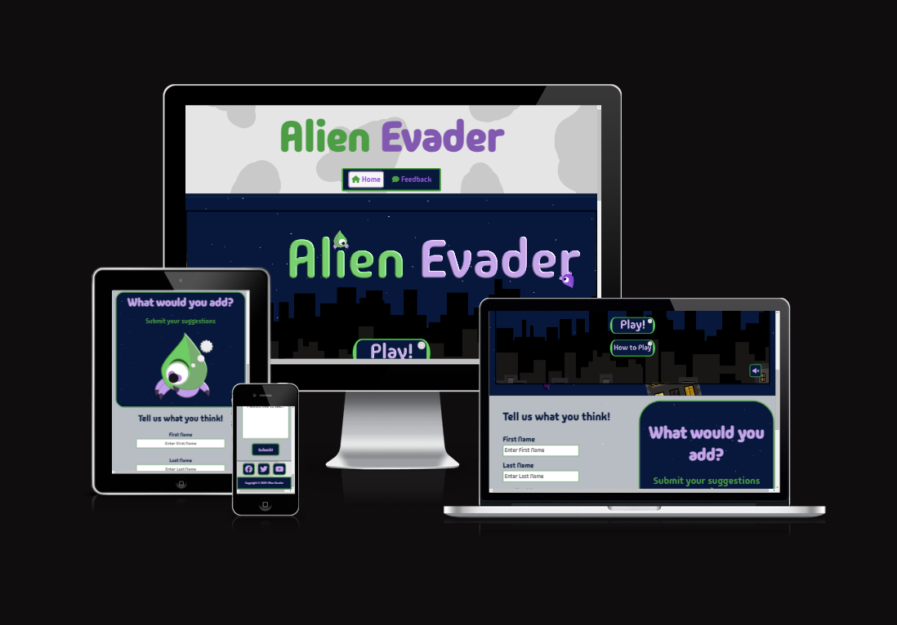
---

# Table of Contents

1. [UX](#ux)
   - [Goals](#goals)
     - [Visitor Goals](#visitor-goals)
     - [Business Goals](#business-goals)
     - [User Stories](#user-stories)
   - [Visual Design](#visual-design)
     - [Wireframes](#wireframes)
     - [Fonts](#fonts)
     - [Icons](#icons)
     - [Colors](#colors)
     - [Site Backgrounds](#site-backgrounds)
     - [Other Site Assets](#other-site-assets)

2. [Features](#features)
   - [Page Elements](#page-elements)
     - [All Web Pages](#all-web-pages)
     - [Header & Navigational Bar](#header--navigational-bar)
     - [Footer](#footer)
   - [Feature Ideas](#feature-ideas)
     - [Site Content](#site-content)
     - [Site Design](#site-design)

3. [Technology Used](#technology-used)
   - [Languages](#languages)
   - [Libraries](#libraries)
   - [Platforms](#platforms)
   - [Other Tools](#other-tools)

4. [Testing](#testing)
   - [Methods](#methods)
     - [Validation](#validation)
     - [General Testing](#general-testing)
   - [Bugs](#bugs)
     - [Known Bugs](#known-bugs)
     - [Fixed Bugs](#fixed-bugs)

5. [Deployment](#deployment)
   - [Github Deployment](#github-deployment)
     - [Github Preparation](#github-preparation)
     - [Github Instructions](#github-instructions)

6. [Credits and Contact](#credits-and-contact)
   - [Credits](#credits)
   - [Contact](#contact)

---

# UX

## Goals

### Visitor Goals

The target audience for Alien Evader are:

- Visitors who want to play a platformer game.
- Visitors of all ages in a age appropriate game.
- Visitors who want to pass the time.
- Visitors who like 2D cartoon games.
- Visitors that want to give their input into development.

The User goals are:

- To play a platformer game.
- To want to return to play.
- To have input on the game's future.
- To connect with a community.
- To learn how to play the game.

The Alien Evader site fills these goals by:

- Providing a functional 2D platforming game on site.
- Providing a Score system users can work on getting the highest score.
- Providing a feedback form users can fill out to give game suggestions.
- Providing a clear set of links to Alien Evader socials.
- Providing a in-game How to Play page with simple instructions.
- Providing a user friendly game and site design for all ages.

### Business Goals

The Business Goals for Alien Evader are:

- Encourage user traffic with a simple and friendly game & site design.
- Gain new ideas from community members submitting feedback forms.
- Gain more traffic to other site social media outlets.
- Build a community around the game for future expansion.

### User Stories

1. As a gamer looking to pass the time. I expect Alien Evader to be replayable & addicting. 
2. I expect the site itself to match the game. It should be clear, concise and certainly not hard to navigate.
3. As a person on the go, I would love to be able to play the game on my way to work.
4. I love when my ideas are listened to by developers, so I would like to be able to submit my suggestions.
5. As someone who loves 2D games, I'd like the game to have a heavy 2D cartoon atmosphere.

## Visual Design

### Wireframes

Wireframes: 

### Fonts

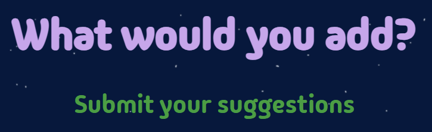

 - The primary font used on the website & game assets was [Madimi One](https://fonts.google.com/specimen/Madimi+One). This font was chosen as the main font because it really gave off the impression it felt at place with cartoon style graphics. It's bubble like appearance really sat well with the other graphics on the page while maintaining a certain level of professionalism. On a practical note, the font is clear & easy to read on all devices and is not harsh on the eyes in any way. While there are other fonts with similiar styles Madimi One was picked to be the best for the job. The font styles well for all text on the page as by design, large bodies of text are not common on the Alien Evader site instead relying on a graphical and simplistic approach. 

 - The secondary font for the website [Rubik](https://fonts.google.com/specimen/Rubik) was picked for it's easy readability and playful style. It is not harsh to look at, and when styled correctly using higher values it looks very alike the primary font's style. It is inviting to all users and fits the cartoon style of the site almost as well.

### Icons

 -  Icons used throughout the website were taken from the [Font Awesome](https://fontawesome.com/icons) icon library. They are utilized in the `<i>` tag.
 -  Icons are used in the navigational Bar & Footer as well as in other assets and pages on the site such as thankyou.html & the 404.html page. They were used to create a more visually appealing site. Appropriate use of icons was done to also visually help users navigate the webpages.

### Colors

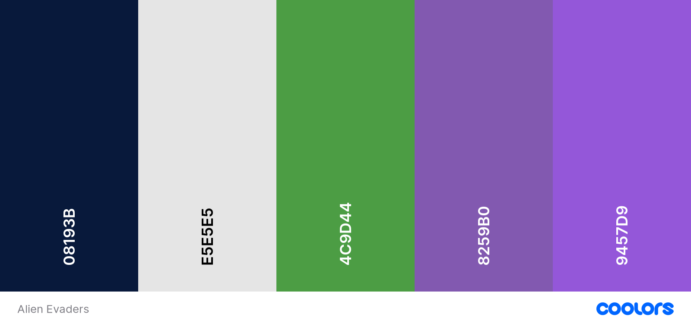

- When designing Alien Evaders, the goal was to create an enviroment for a little Alien to jump across rooftops. Night time was considered to be the best backdrop for the game and so a color palette was deisgned around that in mind. Each color was picked to contrast and compliment each other. As the site needed to match the game's theme, that was also kept in mind when colors were chosen.
- The deep blue color on the palette, Oxford Blue or #08193B, was chosen as the night sky. It was felt that this blue was the most suitable, indicating a dark enviroment that would contrast perfectly to the more vibrant colors both on the game and on the webpages. It was important to use the color appropriately otherwise, the site would appear far too dark, hard to read and overbearing for users.
- The White-like color, Platinum or #E5E5E5, was used to directly contrast and match the dark themes of Oxford Blue, to brighten up the page. That is fitting as this color was used as the Moon assets and the stars in the night sky. This color was the best kind of white to use as it was not too bright on the eyes but not too dull either.
- Pigment Green or #4C9D44 was one of the colors chosen for the Alien character and a support color for text and some elements on the pages. It was often used as borders to contrast the Oxford Blue. This particular green was chosen, as the common trope for aliens in media are green and this site was designed around the little green alien, it was important to use a green not too dark or not to light. It was a conscious choice to use the green mostly sparingly as a supporting color and a highlight, because it helps the user focus on the character while playing the game.
- Two purples were used both on the site and on the game assets of Alien Evader, Royal Purple & Amethyst or #8259B0 & #9457D9 respectively. These colors were used quite frequently as font-color as they contrasted well with the Oxford Blue backgrounds and the Pigment Green borders. Royal Purple was introduced to the site for better accessibility where the Amethyst coloring did not contrast as well with the Platinum coloring. Instead the Amethyst coloring was used on other assets most notably the Alien's legs.

### Site Backgrounds

Star & Night Sky Background

- Like every asset on Alien Evader, this was hand created using [Affinity Designer 2](https://affinity.serif.com/en-gb/designer/). Utilizing Oxford Blue for the sky & Platinum for the Moon & stars.
- It felt natural to use this as the main site background, and used quite frequently for styling other parts of the site such as the feedback section.

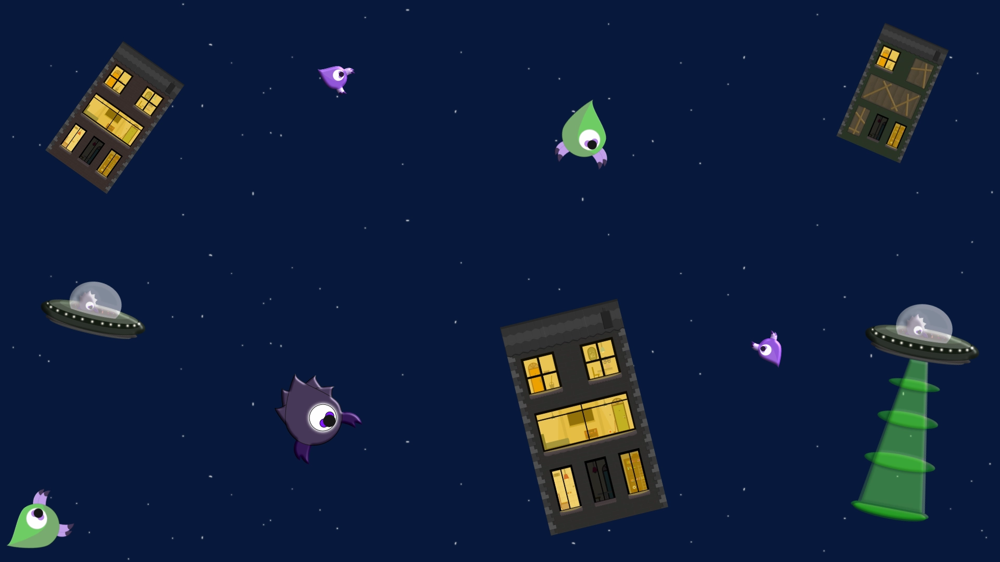

Game Section Wallpaper

- This image was used as the background for the game section on the page. It compiles multiple game assets onto an image as a wallpaper. Using it behind the game section in index.html, allows the section have a interesting background while not looking out of place or too distracting for users playing the game. It is most noticable on Laptop & Desktop sized screens.   
---

Header & Footer Wallpaper

- This image was used as the background image for the Header & Footer elements, alongside some other elements on the webpages. It references the style the moon which matches the one found in game.
- The purpose of using this image, was to give the elements that uses it, such as the Header & Footer, a texture styling so that they are not one singular solid color. It makes these elements match the page styling so much better.

### Other Site Assets

There are a large amount of custom made assets made for Alien Evader. To view these assets please see the Google Drive folder here: https://drive.google.com/drive/folders/1xaAKbgmLqbPimEjjYu5Sn4fLmKJ2nkPO?usp=sharing

# Features

## Page Elements

### All Web Pages

### Header & Navigational Bar

- The Header & Navigational bar is located on every page of the website. It was designed to match the cartoon style of the game, while being clear and concise. It provides a link to the Home page and a shortcut to the feedback section on the page.
- The Header itself is a link to the Home page when clicked. 
- The Home button is given a `.active` class to indicate when the user's on that page.
- The links have been given a hover affect for better user interactivity. 
- The Navigational bar was deisgned with easy expansion in mind if more pages are required.
- It is responsive to the device viewport. 

### Footer

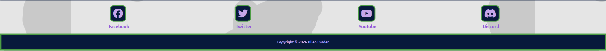

- The Footer is located on every page of the website. It is designed to match the Header & Navigational bar, and fit the style of the page perfectly. 
- The Footer's purpose is to contain links to the social medias of the Alien Evader community. It also has the copyright message below the social media buttons. 
- The Footer was inspired by the ["Love Running"](https://learn.codeinstitute.net/login?next=/courses/course-v1%3ACodeInstitute%2BLRFX101%2B2023_Q2/courseware/e805068059af42af87681032aa64053f/7525117e5cd144daa2a7b0c57843bbee/) project by Code Institute. Any code taken was modified and styled for the Alien Evader website in mind adding buttons and a highlight feature, alongside the copyright information to indivudualize this site's footer.
- When hovering over a button with a mouse in the Footer, it highlights the icon. This is done for aesthetic purposes giving the user more interaction on the site. 
- On larger screens such as Desktop the buttons have pairing text with them underneath.

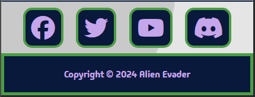

- The Footer is responsive to viewports. On smaller screens such as Mobile the text is hidden to conserve space for users.

### Index Page

- The site has been designed so that this is the Main page of Alien Evader. It is where site users will spend majority of their time as both the Phaser JavaScript game & feedback form is located on it. The `index.html` has been designed simply, to not overwhelm the user once they come onto the website, and has been carefully designed to match the aesthic of the game.
- The first section contains the Alien Evader game canvas itself. 

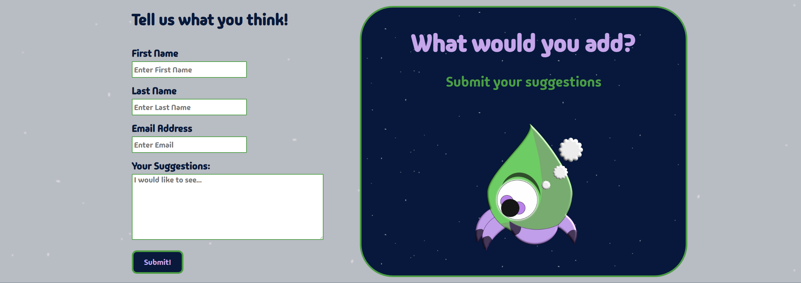

- The second section is for the feedback form where users can fill in a form to submit feedback & give their suggestions for game ideas.
- Using the attributes `type=""` & `required` all fields must be filled in correctly before the form is submitted.
- If the form has been filled out correctly and the submit button has been clicked it will send users to the `thankyou.html` page.

### The Alien Evader Game

The Alien Evader game was created using the [Phaser](https://phaser.io) Framework. The Game is divided into multiple `scenes` and imported into the `<script.js>` file. Alien Evader uses `
` as buttons which have been styled using CSS & custom assets as images. 

While an attempt was made to have the game completely functional on all devices, unforeseen issues arose with the Phaser code causing the scene background images to not appear as they should and due to the problem not being fixable for the project deadline; the game may not yet be working as intended on Mobile and Tablet sized devices.

The Game Menu Scene

- The Play button changes the `scene` and allows the user to begin the game.
- The How to Play button sends the user to a new `scene` revealing a styled `
` providing instructions of how to play.
- The Audio button switches on & off the music for the game, by default the audio is off. 

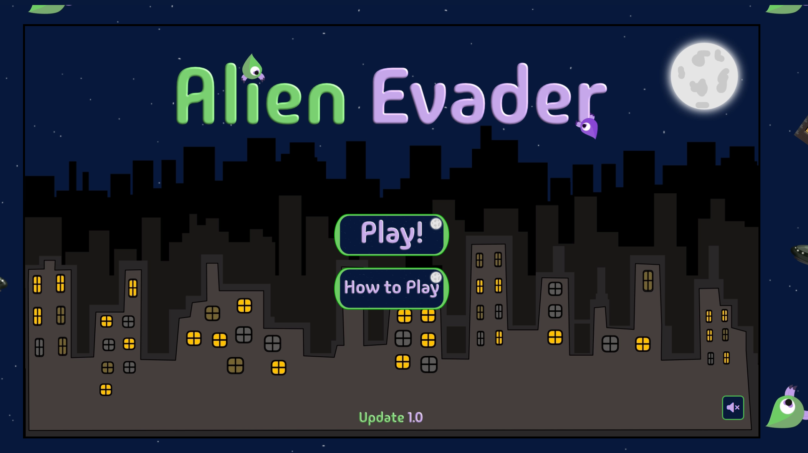

The Game Scene

- Users can control the alien with `A & D` or `Left & Right Arrow` keys and `Space` to Jump. 
- Users are to jump across the buildings and not fall down. Two game over conditions exist, one for falling down between the buildings & one if you hit the left side of the canvas.
- Buildings act as platforms, 7 variations of buildings were designed and randomly are created utilizing an array in `game.js`.
- Score increases over time the longer the game is active and gives the user a reason to keep playing. 

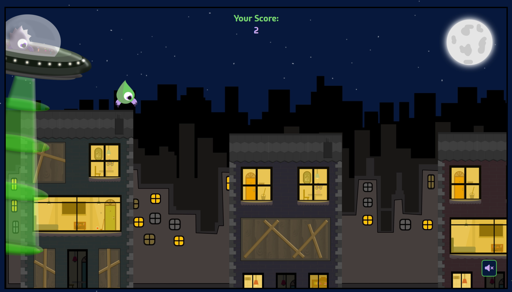

The Game Over Scene

- Users final score result appears on the page. 
- A restart button was implemented for a better user experience.
- A Menu button appears so that users can return to the main menu of the game.

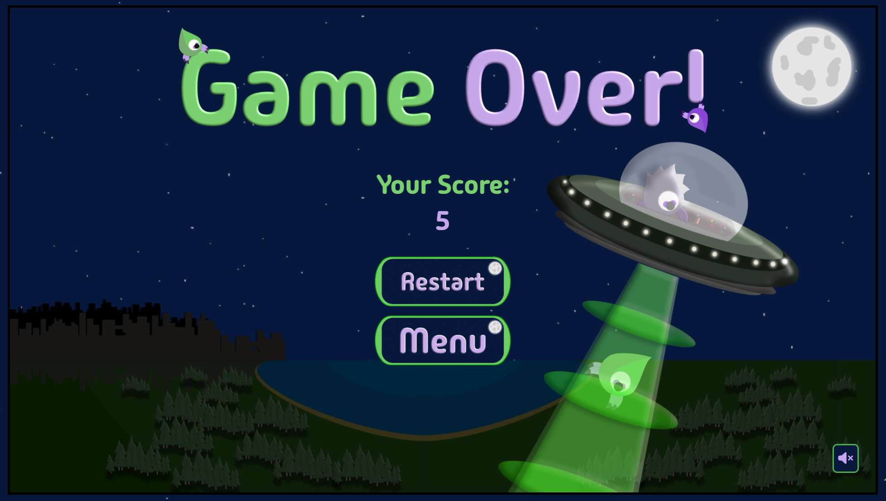

## Additional Site Features

### Thank You Page

- Upon a user successfully submitting a form, the webpage changes to the `thankyou.html` webpage.
- This page was designed to communicate to the user that their feedback was collected by the system.
- The Thank You page was styled with the header and footer of `index.html` maintaining the same theme in uniform with the rest of the site.
- It provides a go back button for users to easily navigate back to the home page.
- It is responsive to the device viewport.
- Due to a bug identified to be caused by the Phaser framework and conscious of the time scope of the project, incorporating the [jQuery](https://jquery.com) Framework was needed to successfully read a completed form & change the webpage from `index.html` to `thankyou.html`. 

It was intended to use [EmailJS](https://www.emailjs.com) to send the user an email for when they submitted a successful form. However due to issues with the functionality of EmailJS on their website and keeping in mind the scope & time of The Alien Evader project, this was pushed to Feature Ideas.

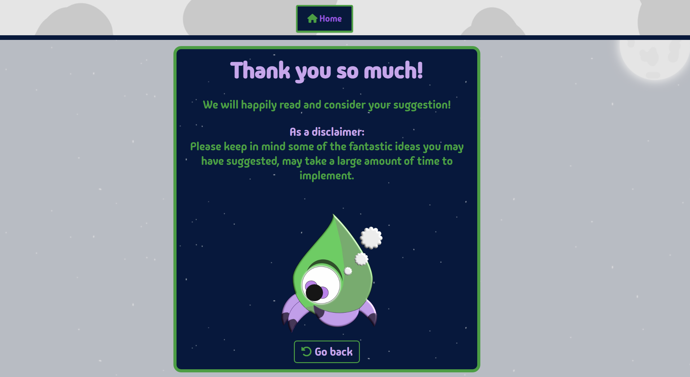

### Notice Message

With the current unexpected issues with the Alien Evader game on Mobile & Tablet devices, and the solution being out of reach for the project deadline. The decision was made to create a Notice message for users on Mobile & Tablet devices, letting users be aware of the current issues with the functionality of the game on their device. 

- On the DOM load if the JavaScript detects a user is on a screen width of 800px or less, a `
` element will appear above the game container.
- A dismiss button is provided to users to remove the message from the site.
- The Message is styled for Tablet & Phone devices 

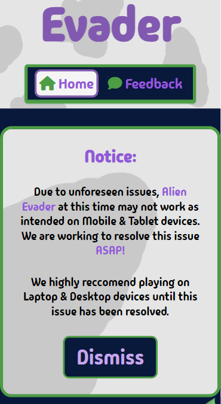

### 404 Error Page

 - Customized 404 error page for website if a page the user is attempting to find is not located.
 - Used 404.html file and styled to match the rest of the website.
 - Provided a brief explaination to the user and provided a Return Home button so that the user may return to the Home page.
 - Return button highlights if a mouse hovers over it.
 - Added a contact support email if problem persists for the user.
 - 404 Error page is responsive to viewport and is readable and accessible to all devices.

 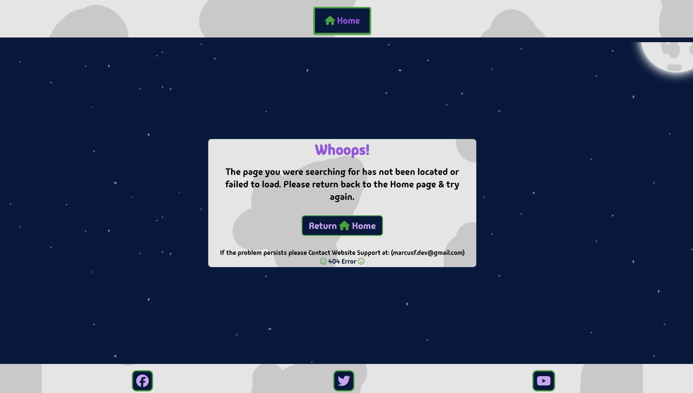

 
## Feature Ideas

### Site Content

- Allow users to create an account on the site.
- Provide a forum where patch notes, discussions and community artwork can be submitted.

### Game Content

- Provide game achievements for users to earn.
- Add working a Leaderboard to save and compare scores & statistics.
- Add animations to the game. 
- Add new sound effects / music tracks to the game.
- Add new assets, potentially choosable character models.

### Site Design

- Intregrate a working version of EmailJS to send users an email of confirmation after they submitted a feedback forum.
- Update the site with some more custom assets where appropriate.
- Change social media links to real Alien Evader socials.

# Technology Used

## Languages

- [HTML](https://github.com/MarcusFDev/alien-evader-project2/blob/main/index.html)
    - Page markup.
- [CSS](https://github.com/MarcusFDev/alien-evader-project2/blob/main/assets/css/style.css)
    - Page styling.
- [JavaScript](https://github.com/MarcusFDev/alien-evader-project2/blob/main/script.js)
    - Page user interactivity.

## Libraries

- [Phaser](https://phaser.io)
    - The Phaser Framework was chosen to help create my JavaScript game.
- [JQuery](https://jquery.com)
    - The JQuery Framework was used to help overcome a crticial issue where some normal JavaScript code was being affected by The Phaser Framework.

## Platforms

- [Github](https://github.com/MarcusFDev/alien-evader-project2/tree/main)
    - Storing code remotely and project deployment.
- [Gitpod](https://www.gitpod.io)
    - IDE for project creation and development.

## Other Tools

- [Favicon Generator](https://www.favicon-generator.org)
    - Tool used to create Website Favicon.
- [Coolers](https://coolors.co)
    - Tool used to create palette image.
- [Am I Responsive?](https://ui.dev/amiresponsive)
    - Tool used to create multiple device image.
- [FreeConvert](https://www.freeconvert.com)
    - Tool used to change images to .webp file types.
- [Affinity Designer 2](https://affinity.serif.com/en-gb/designer/)
    - Software used to create all the site & game imagery by hand.
- [Audacity](https://www.audacityteam.org)
    - Software used to edit game audio into a better loop.

# Testing

## Methods

### Validation

- 

### General Testing

- 

## Bugs

### Known Bugs

- 

### Fixed Bugs

- 

# Deployment

## Github Deployment

### Github Preparation

Requirements:

- You need a GitHub account.

### Github Instructions

1. Log into your Github account and naviagte to this link to the project repository: https://github.com/MarcusFDev/alien-evader-project2/tree/main.
2. You can choose to create your own repository and copy or clone the project code.
3. Go to the Settings page of the repository.
4. Under the Code and automation section scroll down and click on Pages.
5. Select the Master Branch as the source and Confirm the selection.
6. Wait a few minutes and the site should be live for viewing. See my own [right here.](https://marcusfdev.github.io/alien-evader-project2/)

## Credits and Contact

### Credits

Phaser Walkthrough online book:
- [Phaser Book](https://blog.ourcade.co) written & published by Tommy Leung.

Game Audio was sourced on [Freesound](https://freesound.org) by these authors:

- [Game Background music](https://freesound.org/people/bigrod2012/sounds/407126/) by bigrod2012.
- [Removed Jump sound](https://freesound.org/people/cabled_mess/sounds/350898/) by cabled_mess.

Code that was taken and edited accordingly:

- Original Footer code by [Code Institute](https://codeinstitute.net/ie/).

### Contact

Please feel free to reach out if you have any questions. Contact me via my email at marcusf.dev@gmail.com